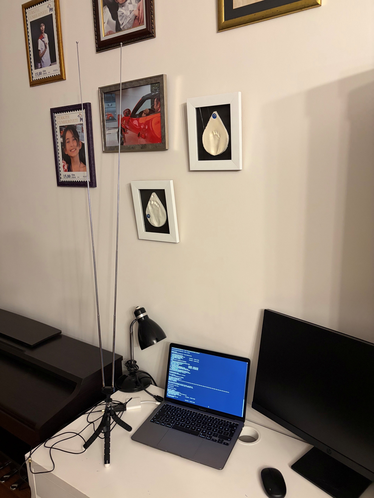
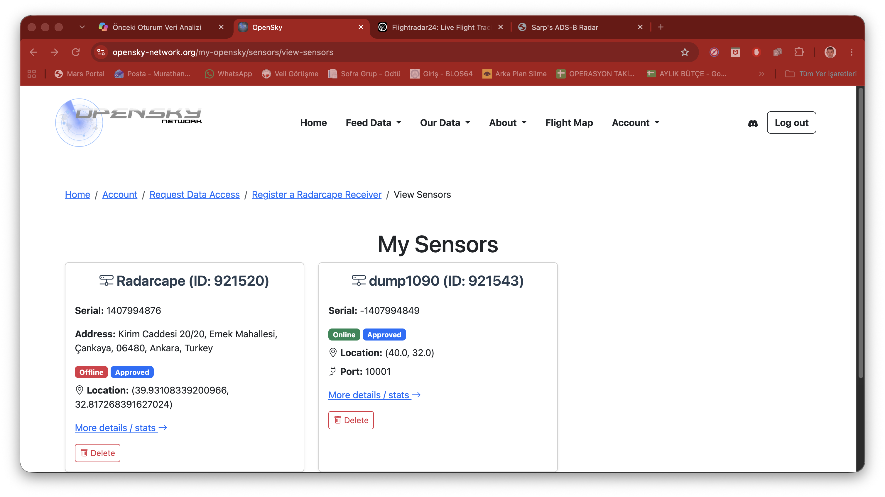
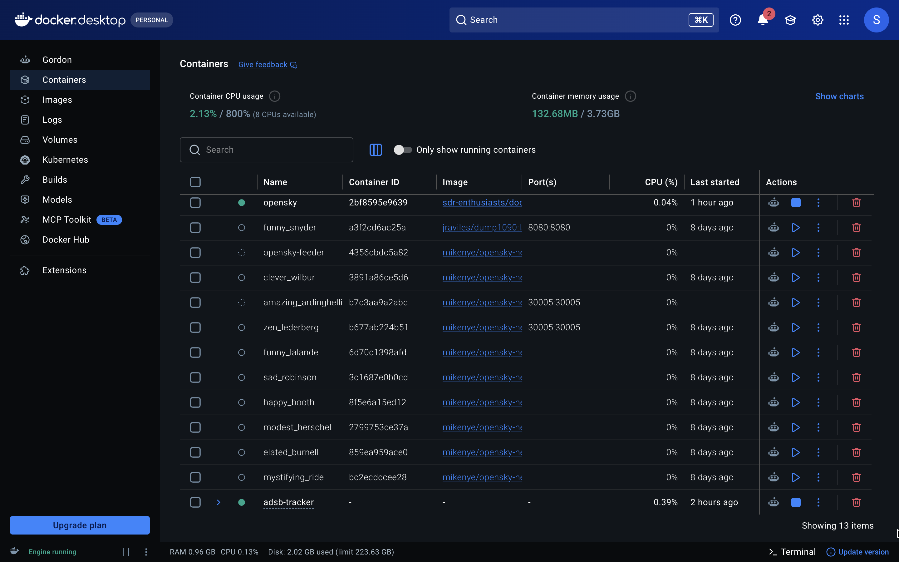
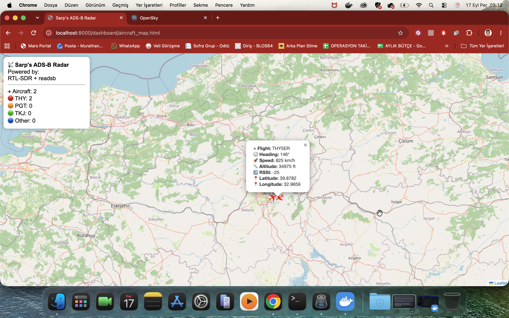
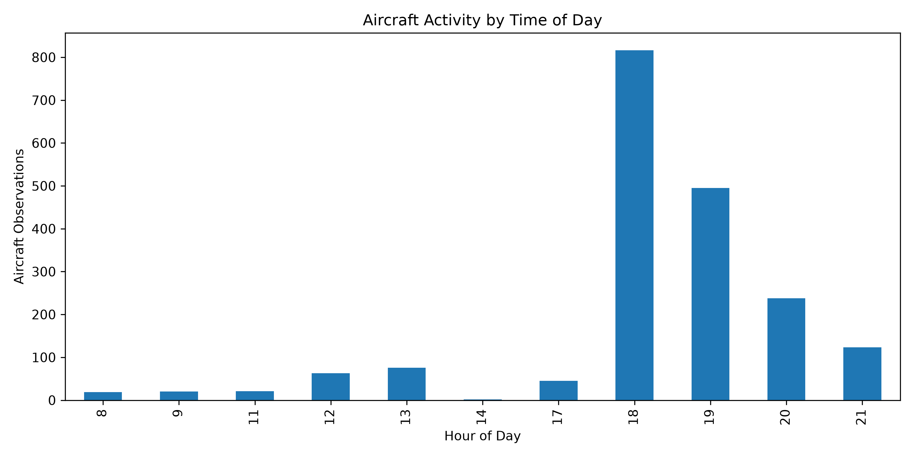
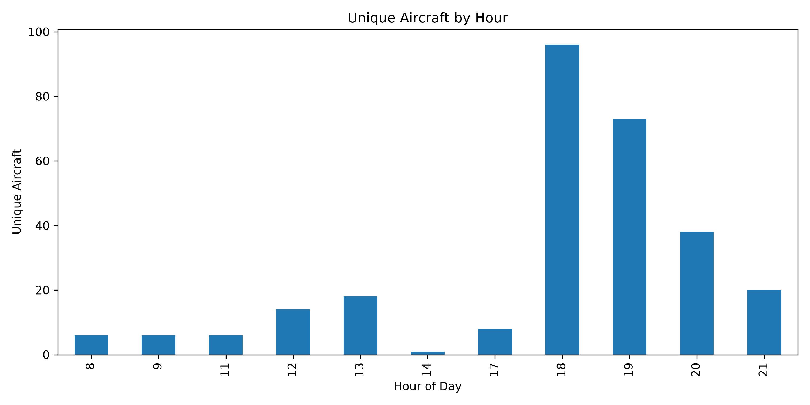

# Aviation Data Project

Aviation Data Project is an ongoing aerospace and aviation data initiative that explores real-world aircraft operations through ADS-B technology, OpenSky Network integration, flight tracking, and data analysis.

The project combines aviation, programming, software-defined radio (SDR), hardware systems, and data analytics to collect, visualize, and analyze real aircraft traffic data using a personal ADS-B receiving station.

---

# Project Vision

This project began with a simple question:

**What can real-world aircraft data teach us about aviation operations?**

By building and operating a personal ADS-B ground station, I aim to better understand aircraft systems, air traffic activity, flight behavior, and aviation data analytics while developing skills in programming, data analysis, and engineering problem-solving.

---

# Phase 1 – ADS-B Ground Station ✅

The first phase focused on building a working ADS-B data collection system capable of receiving, decoding, storing, and visualizing aircraft telemetry.

---

## ADS-B Ground Station Setup

The image below shows the operational ADS-B receiving station used for this project.

The setup includes an RTL-SDR Blog V3 receiver, dipole antenna system, and a laptop running ADS-B decoding and data collection services.



*Operational ADS-B receiving station used for real-time aircraft tracking, OpenSky Network integration, and aviation data collection.*

### Ground Station Components

- RTL-SDR Blog V3 Receiver
- ADS-B Dipole Antenna
- readsb Decoder
- OpenSky Network Feeder
- Real-Time Data Collection Services
- Aviation Analytics Infrastructure

---

## Hardware & Software

### Hardware

- RTL-SDR Blog V3
- ADS-B Antenna System
- Personal ADS-B Ground Station

### Software

- readsb
- OpenSky Network Feeder
- Python
- JSON Data Streams
- CSV Logging System
- Web-Based Radar Dashboard
- Docker

---

## System Deployment

### OpenSky Network Account

The ADS-B ground station is connected to the OpenSky Network and contributes aircraft tracking data to the global aviation research community.


*OpenSky Network account used for ADS-B data contribution.*

---

### OpenSky Sensor Registration

The ADS-B receiver has been successfully registered and approved as an OpenSky data source.



*Registered and approved ADS-B sensors within the OpenSky Network.*

---

### ADS-B Infrastructure

The system operates through a Docker-based deployment environment supporting ADS-B decoding, data collection, OpenSky integration, and dashboard services.



*Docker containers supporting ADS-B data collection and OpenSky feeder operations.*

---

## Sarp's ADS-B Radar Map

A custom web-based radar dashboard developed to visualize real-time ADS-B aircraft telemetry collected by the personal ground station.

The dashboard provides a live view of aircraft positions, tracks, and telemetry data while supporting ongoing aviation data collection and analysis.



*Real-time aircraft tracking dashboard connected to the ADS-B ground station.*

### Dashboard Features

✅ Real-time aircraft tracking

✅ Live ADS-B telemetry visualization

✅ Position and track monitoring

✅ Aircraft movement observation

✅ Integration with JSON data streams

✅ Support for future aviation analytics

---

## System Architecture

```text
RTL-SDR Blog V3
        │
        ▼
      readsb
        │
        ├── JSON Feed
        ├── CSV Logging
        ├── Radar Dashboard
        └── OpenSky Network
```

---

## Data Sources

- RTL-SDR Receiver
- ADS-B Broadcast Messages
- readsb Decoder
- OpenSky Network
- Real-Time Aircraft Telemetry

---

## Current Status

✅ Personal ADS-B ground station deployed

✅ RTL-SDR Blog V3 configured and operational

✅ ADS-B messages successfully received and decoded

✅ Real-time aircraft tracking operational

✅ JSON telemetry collection active

✅ Historical CSV logging active

✅ Raw ADS-B hexadecimal message capture active

✅ ADS-B protocol-level data collection established

✅ Telemetry decoding validation completed

✅ Automated startup and data collection configured

✅ OpenSky Network feeder online

✅ OpenSky Network data contribution active

✅ Interactive radar dashboard operational

✅ Continuous aircraft telemetry archiving established

✅ Preliminary analysis in progress

---

## Current Capabilities

✅ Real-time aircraft tracking

✅ Aircraft position decoding

✅ ADS-B message decoding

✅ Raw hexadecimal ADS-B message capture

✅ ADS-B protocol-level data collection

✅ Live JSON telemetry feeds

✅ Historical CSV telemetry logging

✅ Telemetry decoding validation

✅ OpenSky Network integration

✅ OpenSky Network data contribution

✅ Interactive aircraft radar dashboard

✅ Aircraft traffic monitoring

✅ Historical aircraft telemetry archiving

✅ Data collection for future analytics and research

---

## Initial Results

✅ Personal ADS-B ground station successfully deployed

✅ Real-time aircraft tracking operational

✅ Continuous ADS-B telemetry collection established

✅ Aircraft position and track decoding verified

✅ ADS-B protocol-level monitoring operational

✅ Raw hexadecimal ADS-B message collection active

✅ Automated JSON and CSV data logging active

✅ OpenSky Network feeder successfully deployed

✅ OpenSky Network data contribution active

✅ Interactive radar dashboard developed and deployed

✅ Historical aircraft telemetry archive established

✅ Aviation analytics infrastructure created for future research projects

---

# Project Roadmap

The Aviation Data Project is designed as a multi-phase aviation data and analytics initiative.

---

## Phase 1 – ADS-B Ground Station ✅

Completed

- RTL-SDR Blog V3 configured
- ADS-B message reception established
- Aircraft telemetry decoding operational
- Historical data logging active
- OpenSky Network integration operational
- Real-time radar dashboard developed

---

# Phase 2 – Aircraft Traffic Analysis Around Ankara

## Current Phase

The goal of this phase is to transform collected ADS-B telemetry into meaningful aviation insights through analysis, visualization, and research.

---

## Analysis Roadmap

| Analysis | Status |
|-----------|-----------|
| Aircraft Activity by Time of Day | ✅ Completed |
| Aircraft Type Distribution Analysis | 🎯 Next Analysis |
| Flight Altitude Analysis | ⏳ Planned |
| Traffic Density Visualization | ⏳ Planned |
| Aircraft Route Analysis | ⏳ Planned |
| Python-Based Aviation Analytics | ⏳ Planned |
| ADS-B Data Visualization Dashboards | ⏳ Planned |
| OpenSky Network Contribution Metrics | ⏳ Planned |

---

# Analysis #1 Completed

## Aircraft Activity by Time of Day

### Research Question

When is aircraft activity around Ankara at its highest?

---

### Dataset

- 1,705 ADS-B observations
- Data collected using a local RTL-SDR ADS-B ground station
- Collection period: approximately 1.5–2 weeks
- Source: readsb + OpenSky integrated receiver

---

### Methodology

ADS-B telemetry records were grouped by local observation hour.

Two complementary approaches were used:

#### Total Aircraft Observations

All recorded ADS-B observations were counted and grouped by hour.

#### Unique Aircraft Analysis

Aircraft were identified using unique HEX addresses.

Multiple observations of the same aircraft were treated as a single aircraft presence within each hour.

---

### Results

| Hour | Unique Aircraft Observed |
|--------|--------:|
| 08 | 6 |
| 09 | 6 |
| 11 | 6 |
| 12 | 14 |
| 13 | 18 |
| 14 | 1 |
| 17 | 8 |
| 18 | 96 |
| 19 | 73 |
| 20 | 38 |
| 21 | 20 |

---

### Key Findings

- Peak traffic activity occurred during the 18:00 hour.
- A maximum of 96 unique aircraft were observed during the busiest period.
- Traffic remained significantly elevated between 18:00 and 20:00.
- Evening traffic levels were consistently higher than other observed periods.

---

### Discussion

Analysis of 1,705 ADS-B observations revealed a clear concentration of aircraft activity during evening hours around Ankara.

Both total observation counts and unique HEX-based aircraft counts support the same conclusion, indicating that the observed peak is not simply the result of repeated recordings of the same aircraft.

The highest concentration of activity occurred during the 18:00 hour, when 96 unique aircraft were detected.

As additional telemetry data continues to be collected, future analyses will determine whether this pattern remains stable over longer observation periods.

---

### Visualization

#### Aircraft Activity by Time of Day



#### Unique Aircraft by Hour



---

### Status

✅ Completed

---

# Analysis #2 Completed

## Aircraft Operator Distribution Analysis

### Research Question

Which aircraft operators appear most frequently around Ankara?

---

### Dataset

- Historical ADS-B observations collected through a local RTL-SDR ground station
- Collection period: approximately 1.5–2 weeks
- Source: readsb + OpenSky integrated receiver

---

### Methodology

Aircraft were grouped according to operator prefixes extracted from ADS-B callsigns.

Examples:

- THY → Turkish Airlines
- PGT → Pegasus Airlines
- QTR → Qatar Airways
- UAE → Emirates
- ETD → Etihad Airways

Observations were aggregated by operator.

---

### Results

| Operator | Observations |
|-----------|-----------:|
| THY | 1255 |
| TKJ | 1189 |
| PGT | 619 |
| QTR | 378 |
| UAE | 252 |
| FDB | 87 |
| ETD | 77 |
| SVA | 64 |
| KAC | 45 |
| ABY | 39 |

---

### Visualization

#### Top 10 Aircraft Operators Around Ankara


---

### Key Findings

- Turkish Airlines (THY) was the most frequently observed operator.
- Turkish Air Force (TKJ) flights represented a significant share of the observed traffic.
- Pegasus Airlines (PGT) ranked as the third most frequently observed operator.
- Qatar Airways (QTR) and Emirates (UAE) were the most frequently observed international operators.
- The collected dataset reflects a mixture of domestic, military, regional, and international traffic around Ankara.

---

### Discussion

The results indicate that aircraft activity around Ankara is dominated by Turkish operators, particularly Turkish Airlines and Turkish Air Force flights.

International traffic is primarily represented by Gulf-region airlines including Qatar Airways, Emirates, Etihad Airways, Flydubai, and Saudia.

This distribution reflects Ankara's role as both a major domestic aviation center and an important transit point for regional international traffic.

---

### Status

✅ Completed

---

## Phase 3 – Flight Corridor Analysis 

Future Phase

### Research Questions

- What are the most commonly used flight corridors around Ankara?
- Which directions account for the highest traffic volume?
- How do arrival and departure routes differ?
- Can ADS-B data reveal common air traffic patterns?

---

## Phase 4 – OpenSky Contribution Metrics 

Future Phase

### Research Questions

- How much data is contributed to OpenSky Network?
- What aircraft types are observed most frequently?
- How consistent is station uptime?
- How can open aviation data support scientific research?

---

## Phase 5 – Aviation Analytics 

Future Phase

### Planned Exploration Areas

- Historical trend analysis
- Aircraft type recognition
- Data visualization dashboards
- Traffic forecasting
- Aviation data reporting
- Advanced telemetry analytics

---

## Why This Project Matters

This project goes beyond simple aircraft tracking.

It combines radio-frequency technology, software-defined radio, aviation systems, programming, visualization, and real-world data collection into a single engineering-focused learning experience.

By collecting ADS-B telemetry and contributing data to the OpenSky Network, the project provides hands-on exposure to technologies used in modern aviation, air traffic monitoring, and aerospace-related data systems.

---

## Educational Value

This project combines:

- Aviation
- Aerospace Learning
- Programming
- Data Analysis
- Radio Frequency Technology
- Software Defined Radio (SDR)
- Open Data Contribution
- Citizen Science
- Engineering Problem Solving

while providing hands-on experience with real-world aircraft data and modern flight-tracking technologies.

---

## Long-Term Goal

The long-term goal of this project is to collect, analyze, and visualize real-world aviation data while developing a better understanding of aircraft operations, flight systems, air traffic activity, and aviation analytics.

The project combines aviation, programming, data analysis, hardware systems, and open aviation data to build a practical aerospace-focused learning experience.

---

## Repository Structure

```text
data/
├── raw/
├── processed/
└── archive/

scripts/

dashboard/

visualizations/

docs/

images/
├── ground-station-setup.jpg
├── opensky-account.png
├── opensky-sensors.png
├── docker-services.png
└── radar-dashboard.png

reports/
├── Phase-2-Aircraft-Traffic-Analysis-Around-Ankara.md
├── Phase-3-Flight-Corridor-Analysis.md
├── Phase-4-OpenSky-Contribution-Metrics.md
└── Phase-5-Aviation-Analytics.md
```

---

## Future Development

Planned future improvements include:

- Advanced aircraft traffic analytics
- Historical trend analysis
- Aircraft type recognition tools
- Interactive data visualizations
- Automated reporting systems
- Real-time flight statistics
- Python-based analytics dashboards
- Expanded OpenSky Network integration

---

## Author

### Sarp Akar

Sept 2026

**Always Curious. Always Learning.**
