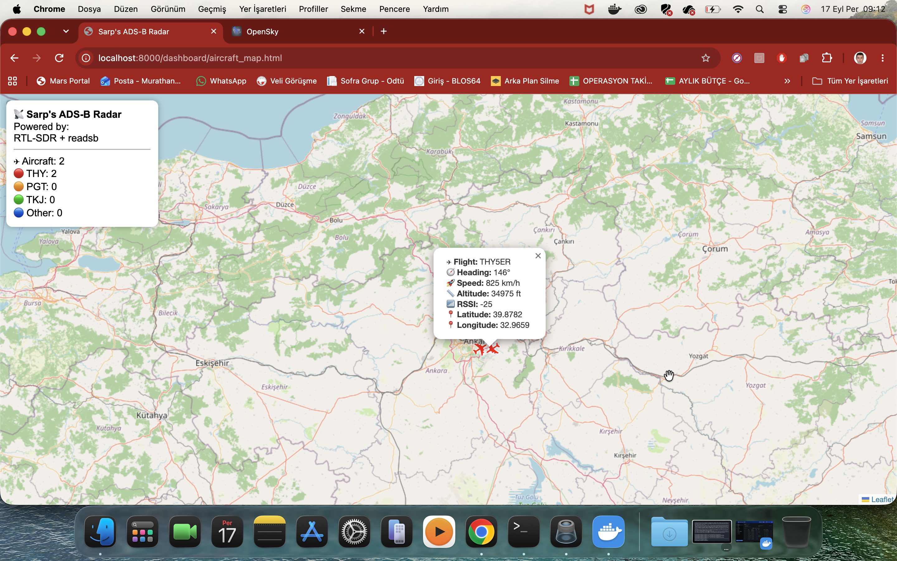
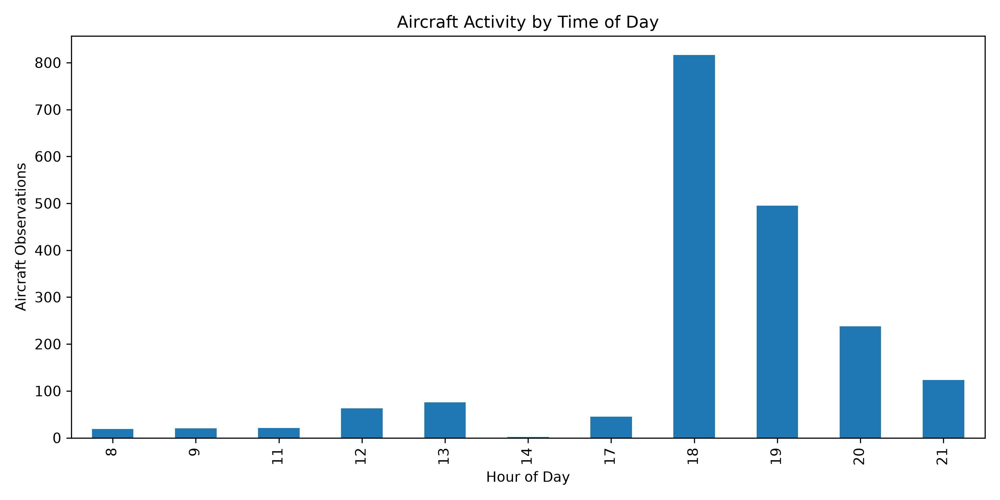
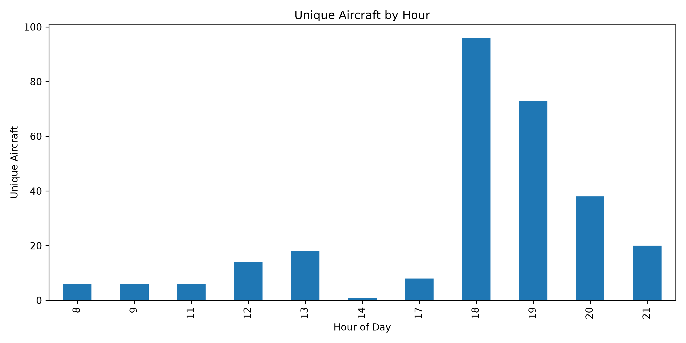
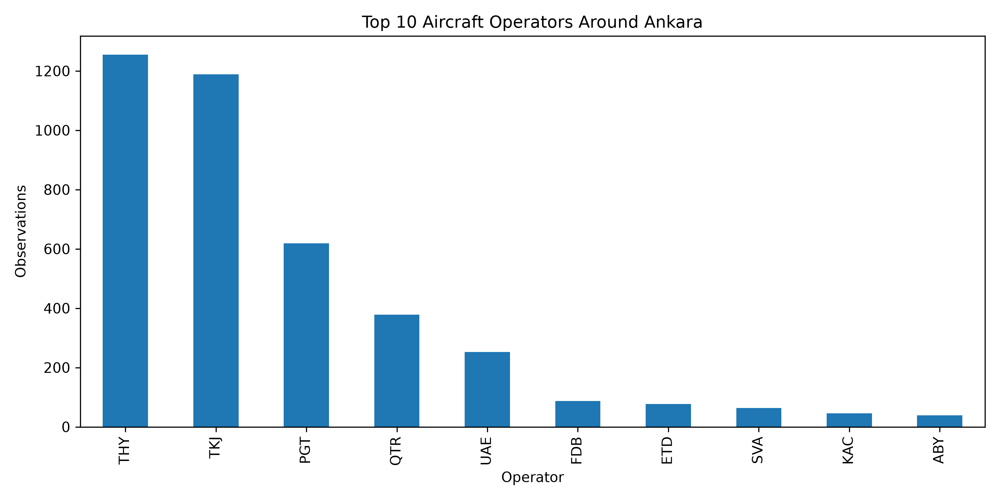
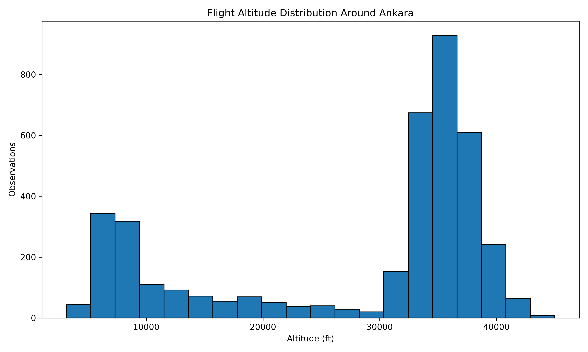
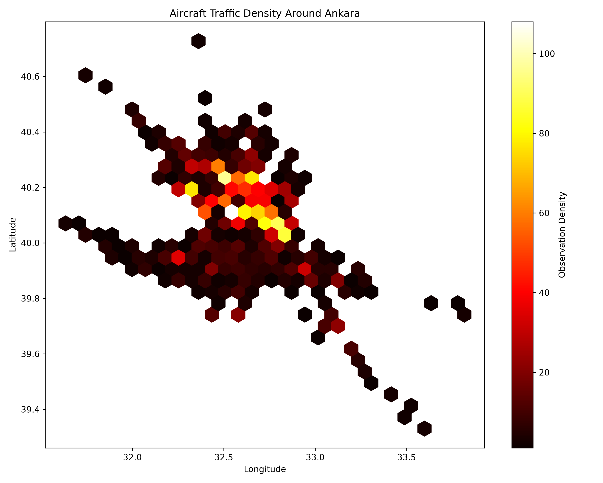
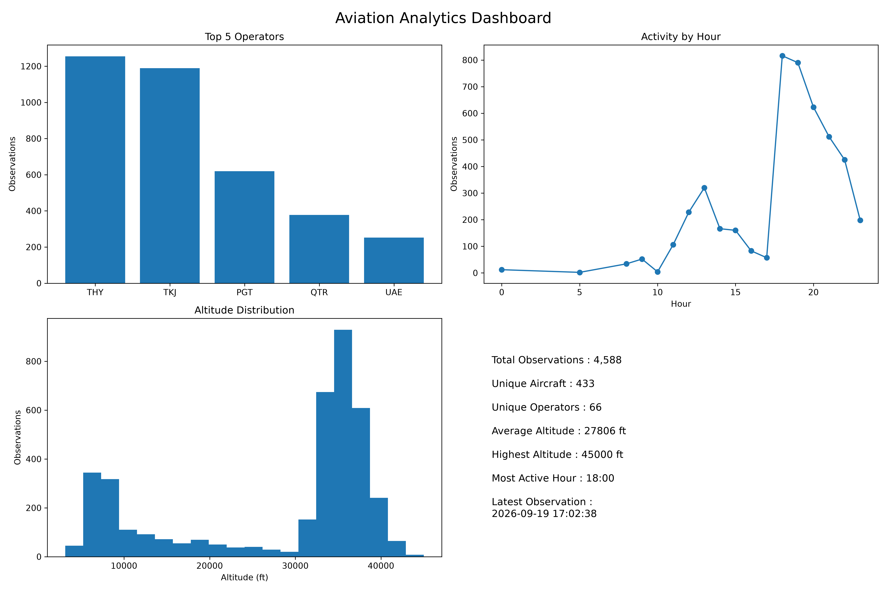
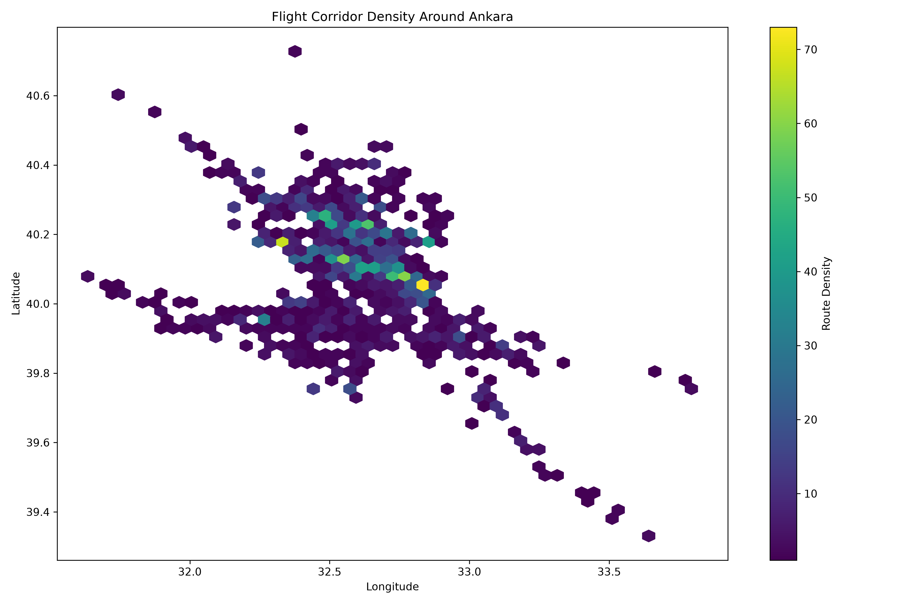

# Aviation Data Project

Aviation Data Project is an ongoing aerospace and aviation data initiative that explores real-world aircraft operations through ADS-B technology, OpenSky Network integration, flight tracking, and data analysis.

The project combines aviation, programming, software-defined radio (SDR), hardware systems, and data analytics to collect, visualize, and analyze real aircraft traffic data using a personal ADS-B receiving station.

---

# Project Vision

This project began with a simple question:

**What can real-world aircraft data teach us about aviation operations?**

By building and operating a personal ADS-B ground station, I aim to better understand aircraft systems, air traffic activity, flight behavior, and aviation data analytics while developing skills in programming, data analysis, and engineering problem-solving.

---

# Phase 1 – ADS-B Ground Station ✅

The first phase focused on building a working ADS-B data collection system capable of receiving, decoding, storing, and visualizing aircraft telemetry.

---

## ADS-B Ground Station Setup

The image below shows the operational ADS-B receiving station used for this project.

The setup includes an RTL-SDR Blog V3 receiver, dipole antenna system, and a laptop running ADS-B decoding and data collection services.


*Operational ADS-B receiving station used for real-time aircraft tracking, OpenSky Network integration, and aviation data collection.*

### Ground Station Components

- RTL-SDR Blog V3 Receiver
- ADS-B Dipole Antenna
- readsb Decoder
- OpenSky Network Feeder
- Real-Time Data Collection Services
- Aviation Analytics Infrastructure

---

## Hardware & Software

### Hardware

- RTL-SDR Blog V3
- ADS-B Antenna System
- Personal ADS-B Ground Station

### Software

- readsb
- OpenSky Network Feeder
- Python
- JSON Data Streams
- CSV Logging System
- Web-Based Radar Dashboard
- Docker

---

## System Deployment

### OpenSky Network Account

The ADS-B ground station is connected to the OpenSky Network and contributes aircraft tracking data to the global aviation research community.


*OpenSky Network account used for ADS-B data contribution.*

---

### OpenSky Sensor Registration

The ADS-B receiver has been successfully registered and approved as an OpenSky data source.


*Registered and approved ADS-B sensors within the OpenSky Network.*

---

### ADS-B Infrastructure

The system operates through a Docker-based deployment environment supporting ADS-B decoding, data collection, OpenSky integration, and dashboard services.


*Docker containers supporting ADS-B data collection and OpenSky feeder operations.*

---

## Sarp's ADS-B Radar Map

A custom web-based radar dashboard developed to visualize real-time ADS-B aircraft telemetry collected by the personal ground station.

The dashboard provides a live view of aircraft positions, tracks, and telemetry data while supporting ongoing aviation data collection and analysis.



*Real-time aircraft tracking dashboard connected to the ADS-B ground station.*

### Dashboard Features

✅ Real-time aircraft tracking

✅ Live ADS-B telemetry visualization

✅ Position and track monitoring

✅ Aircraft movement observation

✅ Integration with JSON data streams

✅ Support for future aviation analytics

---

## System Architecture

```text
RTL-SDR Blog V3
        │
        ▼
      readsb
        │
        ├── JSON Feed
        ├── CSV Logging
        ├── Radar Dashboard
        └── OpenSky Network
```

---

## Data Sources

- RTL-SDR Receiver
- ADS-B Broadcast Messages
- readsb Decoder
- OpenSky Network
- Real-Time Aircraft Telemetry

---

## Current Status

✅ Personal ADS-B ground station deployed

✅ RTL-SDR Blog V3 configured and operational

✅ ADS-B messages successfully received and decoded

✅ Real-time aircraft tracking operational

✅ JSON telemetry collection active

✅ Historical CSV logging active

✅ Raw ADS-B hexadecimal message capture active

✅ ADS-B protocol-level data collection established

✅ Telemetry decoding validation completed

✅ Automated startup and data collection configured

✅ OpenSky Network feeder online

✅ OpenSky Network data contribution active

✅ Interactive radar dashboard operational

✅ Continuous aircraft telemetry archiving established

✅ Advanced aviation analytics pipeline established

---

## Current Capabilities

✅ Real-time aircraft tracking

✅ Aircraft position decoding

✅ ADS-B message decoding

✅ Raw hexadecimal ADS-B message capture

✅ ADS-B protocol-level data collection

✅ Live JSON telemetry feeds

✅ Historical CSV telemetry logging

✅ Telemetry decoding validation

✅ OpenSky Network integration

✅ OpenSky Network data contribution

✅ Interactive aircraft radar dashboard

✅ Aircraft traffic monitoring

✅ Historical aircraft telemetry archiving

✅ Data collection for future analytics and research

---

## Initial Results

✅ Personal ADS-B ground station successfully deployed

✅ Real-time aircraft tracking operational

✅ Continuous ADS-B telemetry collection established

✅ Aircraft position and track decoding verified

✅ ADS-B protocol-level monitoring operational

✅ Raw hexadecimal ADS-B message collection active

✅ Automated JSON and CSV data logging active

✅ OpenSky Network feeder successfully deployed

✅ OpenSky Network data contribution active

✅ Interactive radar dashboard developed and deployed

✅ Historical aircraft telemetry archive established

✅ Aviation analytics infrastructure created for future research projects

---

# Project Roadmap

The Aviation Data Project is designed as a multi-phase aviation data and analytics initiative.

---

## Phase 1 – ADS-B Ground Station ✅

Completed

- RTL-SDR Blog V3 configured
- ADS-B message reception established
- Aircraft telemetry decoding operational
- Historical data logging active
- OpenSky Network integration operational
- Real-time radar dashboard developed

---

# Phase 2 – Aircraft Traffic Analysis Around Ankara

The goal of this phase is to transform collected ADS-B telemetry into meaningful aviation insights through analysis, visualization, and research.

---

## Analysis Roadmap

| Analysis | Status |
|-----------|-----------|
| Aircraft Activity by Time of Day | ✅ Completed |
| Aircraft Type Distribution Analysis | ✅ Completed |
| Flight Altitude Analysis | ✅ Completed |
| Traffic Density Visualization | ✅ Completed  |
| Aircraft Route Analysis | ✅ Completed |
| Python-Based Aviation Analytics | ✅ Completed |
| ADS-B Data Visualization Dashboards | ✅ Completed |
| OpenSky Network Contribution Metrics | ✅ Completed |

---

# Analysis #1 

## Aircraft Activity by Time of Day

### Research Question

When is aircraft activity around Ankara at its highest?

---

### Dataset

- 1,705 ADS-B observations
- Data collected using a local RTL-SDR ADS-B ground station
- Collection period: approximately 1.5–2 weeks
- Source: readsb + OpenSky integrated receiver

---

### Methodology

ADS-B telemetry records were grouped by local observation hour.

Two complementary approaches were used:

#### Total Aircraft Observations

All recorded ADS-B observations were counted and grouped by hour.

#### Unique Aircraft Analysis

Aircraft were identified using unique HEX addresses.

Multiple observations of the same aircraft were treated as a single aircraft presence within each hour.

---

### Results

| Hour | Unique Aircraft Observed |
|--------|--------:|
| 08 | 6 |
| 09 | 6 |
| 11 | 6 |
| 12 | 14 |
| 13 | 18 |
| 14 | 1 |
| 17 | 8 |
| 18 | 96 |
| 19 | 73 |
| 20 | 38 |
| 21 | 20 |

---

### Key Findings

- Peak traffic activity occurred during the 18:00 hour.
- A maximum of 96 unique aircraft were observed during the busiest period.
- Traffic remained significantly elevated between 18:00 and 20:00.
- Evening traffic levels were consistently higher than other observed periods.

---

### Discussion

Analysis of 1,705 ADS-B observations revealed a clear concentration of aircraft activity during evening hours around Ankara.

Both total observation counts and unique HEX-based aircraft counts support the same conclusion, indicating that the observed peak is not simply the result of repeated recordings of the same aircraft.

The highest concentration of activity occurred during the 18:00 hour, when 96 unique aircraft were detected.

As additional telemetry data continues to be collected, future analyses will determine whether this pattern remains stable over longer observation periods.

---

### Visualization

#### Aircraft Activity by Time of Day



#### Unique Aircraft by Hour



---

### Status

✅ Completed

---

# Analysis #2 Completed

## Aircraft Operator Distribution Analysis

### Research Question

Which aircraft operators appear most frequently around Ankara?

---

### Dataset

- Historical ADS-B observations collected through a local RTL-SDR ground station
- Collection period: approximately 1.5–2 weeks
- Source: readsb + OpenSky integrated receiver

---

### Methodology

Aircraft were grouped according to operator prefixes extracted from ADS-B callsigns.

Examples:

- THY → Turkish Airlines
- PGT → Pegasus Airlines
- QTR → Qatar Airways
- UAE → Emirates
- ETD → Etihad Airways

Observations were aggregated by operator.

---

### Results

| Operator | Observations |
|-----------|-----------:|
| THY | 1255 |
| TKJ | 1189 |
| PGT | 619 |
| QTR | 378 |
| UAE | 252 |
| FDB | 87 |
| ETD | 77 |
| SVA | 64 |
| KAC | 45 |
| ABY | 39 |

---

### Visualization

#### Top 10 Aircraft Operators Around Ankara



---

### Key Findings

- Turkish Airlines (THY) was the most frequently observed operator.
- Turkish Air Force (TKJ) flights represented a significant share of the observed traffic.
- Pegasus Airlines (PGT) ranked as the third most frequently observed operator.
- Qatar Airways (QTR) and Emirates (UAE) were the most frequently observed international operators.
- The collected dataset reflects a mixture of domestic, military, regional, and international traffic around Ankara.

---

### Discussion

The results indicate that aircraft activity around Ankara is dominated by Turkish operators, particularly Turkish Airlines and Turkish Air Force flights.

International traffic is primarily represented by Gulf-region airlines including Qatar Airways, Emirates, Etihad Airways, Flydubai, and Saudia.

This distribution reflects Ankara's role as both a major domestic aviation center and an important transit point for regional international traffic.

---

### Status

✅ Completed

---

# Analysis #3 – Flight Altitude Analysis

## Research Question

What altitude ranges are most frequently observed around Ankara?

---

### Dataset

- 3,959 altitude observations
- Historical ADS-B telemetry collected through a local RTL-SDR ground station
- Collection period: approximately 1.5–2 weeks

---

### Results

| Metric | Value |
|----------|----------:|
| Total Observations | 3,959 |
| Average Altitude | 27,806 ft |
| Minimum Altitude | 3,150 ft |
| Maximum Altitude | 45,000 ft |

### Visualization

#### Flight Altitude Distribution



---

### Key Findings

- The average observed altitude was 27,806 ft.
- The lowest recorded altitude was 3,150 ft.
- The highest recorded altitude was 45,000 ft.
- Two major altitude clusters were identified.
- The first cluster was concentrated between 5,000 and 10,000 ft.
- The second and dominant cluster was concentrated between 33,000 and 39,000 ft.
- Most observations corresponded to high-altitude cruise traffic crossing the Ankara region.

---

### Discussion

The altitude distribution indicates that the majority of observed aircraft were operating at cruise altitudes typical of commercial en-route traffic.

A smaller concentration of observations was identified below 10,000 ft, representing aircraft during climb, descent, or local operations.

These findings suggest that Ankara's airspace is heavily influenced by both domestic air traffic and international transit routes crossing central Türkiye.

---

### Status

✅ Completed
---

# Analysis #4 – Traffic Density Visualization

## Research Question

Where is aircraft traffic concentrated around Ankara?

---

### Dataset

- 4,588 ADS-B observations
- 2,651 observations with valid coordinates
- Historical telemetry collected through a local RTL-SDR ground station

---

### Results

| Metric | Value |
|----------|----------:|
| Total Observations | 4,588 |
| Coordinate Observations | 2,651 |
| Latitude Range | 39.33° – 40.73° |
| Longitude Range | 31.63° – 33.82° |

---

### Visualization

#### Aircraft Traffic Density Around Ankara



---

### Key Findings

- Aircraft activity is concentrated along several recurring flight corridors.
- The highest observation density was identified in the central observation area around Ankara.
- Multiple traffic clusters suggest repeated use of specific routes.
- The observed pattern reflects both domestic and international transit traffic.

---

### Discussion

The density map indicates that aircraft movements around Ankara are not uniformly distributed.

Instead, traffic is concentrated along several major corridors that are repeatedly used by aircraft crossing the region.

The highest-density cells correspond to the most frequently observed flight paths within the collected ADS-B dataset.

These findings support previous analyses indicating that Ankara acts as both a domestic aviation hub and a significant transit point for regional air traffic.

---

### Status

✅ Completed

---

## Phase 5 – Aviation Analytics

## Overview

Phase 5 focuses on transforming collected ADS-B telemetry into actionable aviation intelligence using Python-based analytics, statistical methods, and data visualization techniques.

This stage combines the results of previous analyses into a unified aviation analytics framework, providing a high-level overview of aircraft activity, operator distribution, altitude profiles, and traffic patterns around Ankara.

---

## Aviation Analytics Dashboard

### Dashboard Visualization



---

## Dataset Summary

| Metric | Value |
|----------|----------:|
| Total Observations | 4,588 |
| Unique Aircraft | 433 |
| Unique Operators | 66 |
| Average Altitude | 27,806 ft |
| Highest Altitude | 45,000 ft |
| Lowest Altitude | 3,150 ft |
| Most Active Hour | 18:00 |
| Latest Observation | 2026-09-19 17:02:38 |

---

## Operator Analytics

### Top 10 Operators

| Operator | Observations |
|----------|----------:|
| THY | 1,255 |
| TKJ | 1,189 |
| PGT | 619 |
| QTR | 378 |
| UAE | 252 |
| FDB | 87 |
| ETD | 77 |
| SVA | 64 |
| KAC | 45 |
| ABY | 39 |

### Observations

- Turkish Airlines (THY) was the most frequently observed operator.
- Turkish Air Force (TKJ) flights represented a significant portion of the recorded traffic.
- Pegasus Airlines (PGT) ranked third among observed operators.
- International operators such as Qatar Airways, Emirates, Etihad Airways, Flydubai, and Saudia were regularly observed within the collected dataset.

---

## Traffic Activity Analytics

### Key Findings

- A total of 4,588 ADS-B observations have been analyzed.
- Aircraft activity peaked during the 18:00 hour.
- The dataset contains 433 unique aircraft and 66 unique operators.
- Traffic patterns indicate a combination of domestic, military, regional, and international air traffic.

---

## Altitude Analytics

### Key Findings

- Average observed altitude: 27,806 ft
- Minimum observed altitude: 3,150 ft
- Maximum observed altitude: 45,000 ft
- The majority of aircraft activity occurred between FL330 and FL390.
- The altitude distribution suggests that a significant portion of observed traffic consists of high-altitude cruise operations crossing Central Türkiye.

---

## Strategic Insights

The aviation analytics dashboard consolidates multiple analyses into a single operational overview.

Results indicate that:

- Ankara's airspace is heavily influenced by Turkish Airlines and Turkish Air Force traffic.
- Peak activity occurs during evening hours.
- Most observed aircraft operate at cruise altitudes typical of medium- and long-haul commercial flights.
- Traffic density and operator distribution demonstrate Ankara's role as both a domestic aviation center and a regional transit corridor.

---

## Analytics Status

✅ Observation Analytics

✅ Time-of-Day Analytics

✅ Operator Analytics

✅ Altitude Analytics

✅ Traffic Density Analytics

✅ Aviation Analytics Dashboard

✅ Aircraft Route Analytics

✅ OpenSky Contribution Metrics

✅ Advanced Predictive Analytics

---

### Aircraft Route Analysis

# Analysis #5 – Aircraft Route Analysis

## Research Question

Which flight corridors are most frequently used around Ankara?

---

### Dataset

- 4,588 ADS-B observations
- 2,651 observations with valid coordinates
- Historical telemetry collected through a local RTL-SDR ground station

---

### Methodology

Aircraft position data were aggregated and visualized using density-based spatial analysis.

A hexagonal density map was generated to identify recurring flight corridors and heavily utilized air routes around Ankara.

---

### Visualization

#### Flight Corridor Density Around Ankara



---

### Key Findings

- Aircraft traffic around Ankara is not randomly distributed.
- Several clearly defined flight corridors can be observed across the monitored airspace.
- The highest traffic density was recorded near the center of the observation area.
- Multiple routes converge near Ankara before continuing toward different directions.
- The most frequently used corridor extends toward the southeast of the monitored region.
- Some parts of the airspace contain significantly more traffic than surrounding areas, indicating repeated use of established air routes.

---

### Plain Language Summary

The analysis shows that aircraft around Ankara do not fly randomly across the sky.

Instead, most aircraft follow a small number of well-defined routes. Several of these routes intersect near the Ankara region, creating areas of higher traffic density.

The results indicate that Ankara is located beneath frequently used flight paths connecting different parts of Türkiye and neighboring regions.

---

### Discussion

The corridor density map reveals a network of recurring flight paths crossing Central Türkiye.

Combined with the altitude and traffic density analyses, the results suggest that Ankara is influenced by both domestic air traffic and high-altitude international transit traffic. The identified corridors represent the most frequently observed pathways within the collected ADS-B dataset.

---

### Status

✅ Completed
---

# Analysis #6 – OpenSky Network Contribution Metrics

## Research Question

How effectively does the ADS-B ground station contribute data to the OpenSky Network?

---

### Dataset

Source: OpenSky Network Sensor Statistics

Sensor Serial Number:

-1407994849

---

### Results

| Metric | Value |
|----------|----------:|
| 24-Hour Activity | 52.9% |
| Maximum Range | 91.1 km |
| Coverage Points | 133 |
| Current Message Rate | 0/min* |

*Measured at the time the statistics page was captured.

---

### Key Findings

- The ADS-B receiver successfully contributes data to the OpenSky Network.
- During the previous 24-hour period, the receiver was active for 52.9% of the time.
- The receiver achieved a maximum reception range of 91.1 km.
- A total of 133 coverage points were recorded.
- Coverage extends across Ankara and surrounding regions.
- The coverage map indicates successful reception of aircraft from multiple directions around the city.

---

### Plain Language Summary

The OpenSky statistics show that the ground station is actively contributing aircraft tracking data to the OpenSky Network.

During the measured period, aircraft were detected up to 91.1 km away from the receiver. The coverage map demonstrates that the station is capable of receiving aircraft from multiple directions around Ankara, contributing useful surveillance data to the global OpenSky aviation database.

---

### Discussion

The recorded coverage area confirms that the ADS-B station is functioning as a useful regional receiver. Although the receiver was offline at the time the statistics page was captured, historical activity and range metrics demonstrate successful participation in the OpenSky Network.

As observation time increases and receiver uptime improves, future contribution metrics are expected to provide broader coverage and larger data volumes.

---

### Status

✅ Completed

# Phase 6 – Trend and Predictive Aviation Analytics

## Objective

Phase 6 focuses on identifying traffic trends, operational patterns, and future predictive opportunities using historical ADS-B telemetry collected through the ADS-B ground station.

Unlike previous phases that focused on descriptive analysis, this phase explores how aviation activity changes over time and investigates whether future traffic behavior can be estimated from historical observations.

---

## Analysis Roadmap

| Analysis | Status |
|-----------|-----------|
| Traffic Growth Analysis | ✅ Completed |
| Daily Traffic Analytics | ✅ Completed  |
| Weekly Pattern Analysis | ✅ Completed |
| Operator Trend Analysis | ✅ Completed  |
| Traffic Forecasting Experiments | ✅ Completed |

---

# Analysis #6.1 – Traffic Growth Analysis

## Research Question

How does aircraft activity change over time?

---

### Dataset

- Historical ADS-B telemetry
- 4,588 aircraft observations
- Local RTL-SDR ADS-B ground station

---

### Results

| Date | Observations |
|------------|------------:|
| 2026-09-17 | 1,106 |
| 2026-09-18 | 2,504 |
| 2026-09-19 | 978 |

---

### Visualization

#### Aircraft Observation Growth Over Time

visualizations/traffic_growth_analysis.png

---

### Key Findings

- A total of 4,588 aircraft observations were analyzed.
- The highest daily observation count occurred on 18 September 2026.
- Daily observation counts varied significantly between collection days.
- Current data volume is sufficient for baseline trend analysis but not yet sufficient for reliable long-term forecasting.

---

### Discussion

The analysis reveals noticeable variation in daily observation counts.

At this stage, changes in observation volume may be influenced by receiver uptime, collection duration, and aircraft traffic activity. Additional weeks of telemetry collection will be 
## Status

✅ Completed

# Analysis #6.2 – Daily Unique Aircraft Trend

## Research Question

How many different aircraft are observed each day?

---

### Dataset

- Historical ADS-B telemetry
- 4,588 aircraft observations
- 433 unique aircraft
- Local RTL-SDR ADS-B ground station

---

### Results

| Date | Unique Aircraft |
|------------|------------:|
| 2026-09-17 | 136 |
| 2026-09-18 | 244 |
| 2026-09-19 | 153 |

---

### Visualization

#### Daily Unique Aircraft Observed

visualizations/daily_unique_aircraft.png


---

### Key Findings

- A total of 433 unique aircraft were observed during the study period.
- The highest number of unique aircraft was observed on 18 September 2026.
- A total of 244 different aircraft were recorded on the busiest day.
- Daily aircraft diversity remained consistently high throughout the observation period.
- The dataset demonstrates substantial variation in aircraft activity between observation days.

---

### Plain Language Summary

This analysis focuses on the number of different aircraft observed each day rather than the total number of ADS-B messages received.

The busiest day was 18 September 2026, when 244 unique aircraft were detected. Even on lower-activity days, more than 130 different aircraft were observed.

These results suggest that the Ankara region experiences a diverse mix of aircraft activity on a daily basis and serves as an active part of Türkiye's air traffic network.

---

### Discussion

Daily observation counts can be affected by receiver uptime and collection duration. However, unique aircraft counts provide a more reliable indicator of actual traffic diversity.

As the dataset grows over additional weeks and months, future analyses will be able to identify recurring daily and weekly traffic patterns and evaluate long-term traffic evolution.

---

### Status

✅ Completed

# Analysis #6.3 – Weekly Pattern Analysis

## Research Question

Are there recurring weekly patterns in aircraft activity around Ankara?

---

### Dataset

- Historical ADS-B telemetry
- 4,588 aircraft observations
- Local RTL-SDR ADS-B ground station
- Current dataset covers three observation days

---

### Results

| Weekday | Observations |
|----------|----------:|
| Thursday | 1,106 |
| Friday | 2,504 |
| Saturday | 978 |

---

### Visualization

#### Aircraft Observations by Weekday

visualizations/weekly_pattern_analysis.png

---

### Key Findings

- Friday recorded the highest number of aircraft observations.
- Thursday showed moderate traffic activity.
- Saturday recorded fewer observations than Friday.
- Current results are based on a limited observation period and should be considered preliminary.

---

### Plain Language Summary

The current dataset suggests that Friday was the busiest observed day, with more than twice as many aircraft observations as Thursday and Saturday.

However, the dataset currently contains observations from only three days. Additional weeks of data collection will be required before reliable weekly traffic patterns can be identified.

---

### Discussion

This analysis establishes the foundation for future weekday traffic studies.

As additional ADS-B telemetry is collected, the dataset will support more comprehensive comparisons between weekdays and weekends, helping identify recurring aviation activity patterns around Ankara.

---

### Status

✅ Completed (Preliminary)

# Analysis #6.3 – Weekly Pattern Analysis

## Research Question

Are there recurring weekly patterns in aircraft activity around Ankara?

---

### Dataset

- Historical ADS-B telemetry
- 4,588 aircraft observations
- Local RTL-SDR ADS-B ground station
- Current dataset covers three observation days

---

### Results

| Weekday | Observations |
|----------|----------:|
| Thursday | 1,106 |
| Friday | 2,504 |
| Saturday | 978 |

---

### Visualization

#### Aircraft Observations by Weekday

visualizations/weekly_pattern_analysis.png

---

### Key Findings

- Friday recorded the highest number of aircraft observations.
- Aircraft activity on Friday was more than double the recorded activity on Thursday.
- Saturday showed lower activity compared to Friday.
- The current dataset does not yet contain enough data to identify reliable long-term weekly patterns.

---

### Plain Language Summary

The current dataset suggests that Friday was the busiest observed day, with 2,504 aircraft observations recorded during the collection period.

Thursday and Saturday showed lower activity levels. However, because the dataset currently covers only three days, these results should be considered preliminary rather than a confirmed weekly traffic pattern.

Additional weeks of ADS-B data collection will be required before reliable weekday and weekend traffic comparisons can be performed.

---

### Discussion

This analysis establishes the foundation for future weekly traffic studies.

As the historical dataset grows, it will become possible to identify recurring patterns, compare weekday and weekend traffic levels, and determine whether specific days consistently experience higher aircraft activity around Ankara.

---

### Status

✅ Completed (Preliminary)

# Analysis #6.4 – Operator Trend Analysis

## Research Question

How does operator activity change over time?

---

### Dataset

- Historical ADS-B telemetry
- 4,588 aircraft observations
- Local RTL-SDR ADS-B ground station
- Analysis based on the five most frequently observed operators

---

### Results

| Date | THY | TKJ | PGT | QTR | UAE |
|------------|----:|----:|----:|----:|----:|
| 2026-09-17 | 311 | 269 | 190 | 81 | 98 |
| 2026-09-18 | 622 | 704 | 372 | 193 | 141 |
| 2026-09-19 | 322 | 216 | 57 | 104 | 13 |

---

### Visualization

#### Top Operator Activity Over Time

!isualizations/operator_trend_analysis.png

---

### Key Findings

- THY and TKJ consistently dominated the observed traffic.
- TKJ recorded the highest single-day activity with 704 observations on 18 September 2026.
- THY remained the most stable operator throughout the observation period.
- PGT activity peaked on 18 September before declining significantly on 19 September.
- QTR activity remained relatively stable compared to the other operators.
- UAE activity decreased substantially on 19 September.

---

### Plain Language Summary

The analysis shows that Turkish Airlines (THY) and Turkish Air Force (TKJ) traffic dominated the observed airspace throughout the collection period.

Both operators experienced their highest activity on 18 September 2026. Pegasus Airlines (PGT) also showed strong activity on that day, while Qatar Airways (QTR) maintained a more consistent presence across all observation days.

Overall, the data suggests that Ankara's airspace is strongly influenced by a combination of commercial airline traffic and military flight activity.

---

### Discussion

Operator activity varied noticeably between observation days.

The highest levels of activity were recorded on 18 September 2026 across nearly all major operators, suggesting either increased traffic volume or longer observation coverage during.

# Analysis #6.5 – Traffic Forecasting Experiment

## Research Question

Can future aircraft activity be estimated using historical ADS-B observations?

---

### Dataset

- Historical ADS-B telemetry
- 4,588 aircraft observations
- Local RTL-SDR ADS-B ground station
- Three-day observation period

---

### Results

| Date | Observations |
|------------|------------:|
| 2026-09-17 | 1,106 |
| 2026-09-18 | 2,504 |
| 2026-09-19 | 978 |
| Forecast | 1,401 |

---

### Visualization

#### Aircraft Traffic Forecast Experiment

```markdown
visualizations/traffic_forecast_experiment.png
```

---

### Key Findings

- A simple trend model was used to estimate future aircraft activity.
- Based on the available historical observations, the model predicts approximately 1,401 aircraft observations for the next observation day.
- The forecast falls between the highest and lowest observed traffic levels.
- Current results should be considered experimental due to the limited size of the dataset.

---

### Plain Language Summary

Using the available ADS-B observation history, a simple forecasting model was created to estimate future traffic levels.

The model predicts approximately 1,401 aircraft observations for the next observation day. While this estimate should not be considered operationally reliable, it demonstrates how historical ADS-B data can be used as a foundation for future predictive aviation analytics.

---

### Discussion

The current dataset contains only three days of observations, which is insufficient for robust forecasting.

However, this analysis establishes the foundation for future predictive models. As additional weeks and months of telemetry data are collected, more sophisticated forecasting techniques can be applied to identify seasonal trends, recurring traffic patterns, and long-term changes in air traffic activity.

---

### Status

✅ Completed

---

## Why This Project Matters

This project goes beyond simple aircraft tracking.

It combines radio-frequency technology, software-defined radio, aviation systems, programming, visualization, and real-world data collection into a single engineering-focused learning experience.

By collecting ADS-B telemetry and contributing data to the OpenSky Network, the project provides hands-on exposure to technologies used in modern aviation, air traffic monitoring, and aerospace-related data systems.

---

## Educational Value

This project combines:

- Aviation
- Aerospace Learning
- Programming
- Data Analysis
- Radio Frequency Technology
- Software Defined Radio (SDR)
- Open Data Contribution
- Citizen Science
- Engineering Problem Solving

while providing hands-on experience with real-world aircraft data and modern flight-tracking technologies.

---

## Long-Term Goal

The long-term goal of this project is to collect, analyze, and visualize real-world aviation data while developing a better understanding of aircraft operations, flight systems, air traffic activity, and aviation analytics.

The project combines aviation, programming, data analysis, hardware systems, and open aviation data to build a practical aerospace-focused learning experience.

---

## Repository Structure

```text
data/
├── raw/
├── processed/
└── archive/

scripts/

dashboard/

visualizations/

docs/

images/
├── ground-station-setup.jpg
├── opensky-account.png
├── opensky-sensors.png
├── docker-services.png
└── radar-dashboard.png

reports/
├── Phase-2-Aircraft-Traffic-Analysis-Around-Ankara.md
├── Phase-3-Flight-Corridor-Analysis.md
├── Phase-4-OpenSky-Contribution-Metrics.md
└── Phase-5-Aviation-Analytics.md
```


---

## Future Development

Planned future improvements include:

- Advanced aircraft traffic analytics
- Historical trend analysis
- Aircraft type recognition tools
- Interactive data visualizations
- Automated reporting systems
- Real-time flight statistics
- Python-based analytics dashboards
- Expanded OpenSky Network integration

---

## Author

### Sarp Akar

Sept 2026

**Always Curious. Always Learning.**
